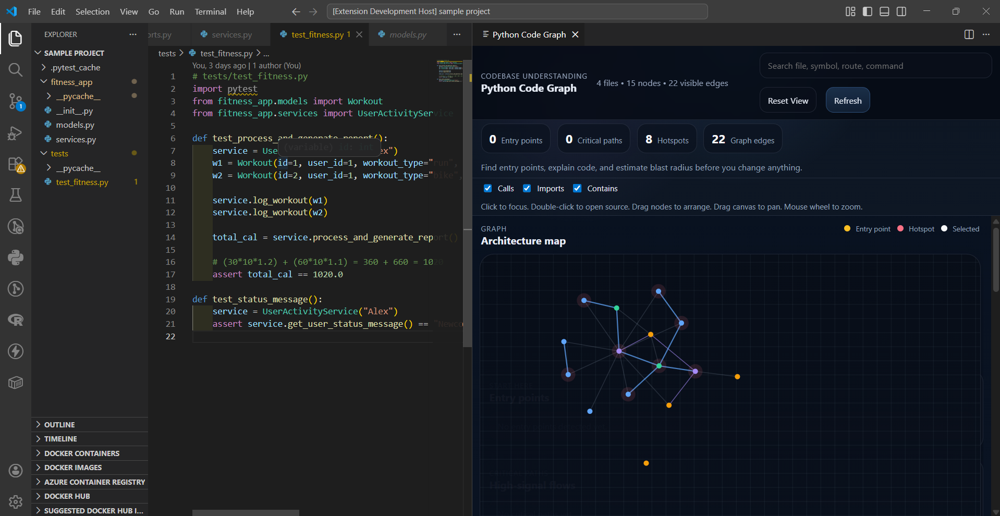

# 🐍 Python Code Graph

[](https://code.visualstudio.com/)
[](https://www.python.org/)
[](https://opensource.org/licenses/MIT)

**Python Code Graph** is a premium VS Code extension designed to provide instant architectural clarity for complex Python codebases. It transforms static code into a dynamic, interactive visualization, helping developers navigate, explain, and analyze code impact with zero friction.

---

## 📸 Screenshots

> [!TIP]
> Place your project screenshots in the `/screenshots` directory to showcase the extension in action.

| Visualization | Analysis Panel |
| :---: | :---: |
|  |  |
| *Interactive Architectural Map* | *Deep Contextual Analysis* |

---

## 🚀 Key Features

### 1. **Architectural Mapping**
Visualize the structure of your project in real-time. The extension scans your workspace to build a directed graph showing:
- **Files & Modules**: The high-level structure of your project.
- **Classes & Methods**: Granular visibility into object-oriented hierarchies.
- **Calls & Imports**: Understand how data and logic flow across boundaries.

### 2. **Entry Point Detection**
Stop hunting for where the code starts. Our heuristic engine automatically identifies:
- `if __name__ == "__main__"` script entries.
- **Web Routes**: FastAPI, Flask, and Django handlers.
- **CLI Commands**: Click and Typer command definitions.
- **Background Tasks**: Celery task definitions.

### 3. **Critical Path Analysis**
Quickly identify the most important execution flows. The extension highlights "High-Signal" paths from entry points to core logic, ensuring you understand the "Golden Path" of your application.

### 4. **Impact Analysis (Blast Radius)**
Before making a change, see what might break. The **Impact** tab estimates the blast radius by showing:
- Direct and indirect callers.
- Upstream and downstream dependencies.
- Affected entry points.

### 5. **AI-Powered "Explain" Panel**
Get a plain-English summary of any symbol. By combining graph relationships, docstrings, and import data, the extension provides a comprehensive narrative of what a class or function does and why it exists.

---

## 🛠 Technical Implementation

### **Static Analysis Engine**
The backend uses a sophisticated AST (Abstract Syntax Tree) scanner implemented in Node.js. Unlike simple regex-based tools, it performs:
- **Heuristic Symbol Resolution**: Resolving local and imported symbols to build a coherent graph.
- **Multi-Framework Support**: Specialized logic for detecting patterns in popular Python frameworks (FastAPI, Flask, Celery, etc.).
- **Relationship Indexing**: Efficiently mapping `contains`, `calls`, and `imports` edges.

### **Modern UI/UX**
The webview is built with a focus on "Premium Aesthetics":
- **Glassmorphism Design**: A sleek, modern interface that feels native to VS Code.
- **Interactive Canvas**: Powered by a high-performance graph rendering engine with zoom, pan, and drag capabilities.
- **Live Search**: Instant filtering across files, symbols, and routes.

---

## 📥 Installation & Usage

1. **Clone the repository**:
   ```bash
   git clone https://github.com/YOUR_USERNAME/python-code-graph.git
   ```
2. **Open in VS Code**:
   ```bash
   code python-code-graph
   ```
3. **Launch the extension**:
   - Press `F5` to open the [Extension Development Host].
   - Open any Python project in the new window.
4. **Visualize**:
   - Run the command: `Python Code Graph: Open Graph` from the Command Palette (`Ctrl+Shift+P`).

---

## 🗺 Roadmap
- [ ] File watcher for real-time incremental re-indexing.
- [ ] Module/Package clustering for large-scale codebases.
- [ ] Enhanced AI summaries using LLM integration.
- [ ] Export graph as SVG/PNG for documentation.

---

## 📄 License
Distributed under the MIT License. See `LICENSE` for more information.

---

**Built with ❤️ for the Python Developer Community.**
